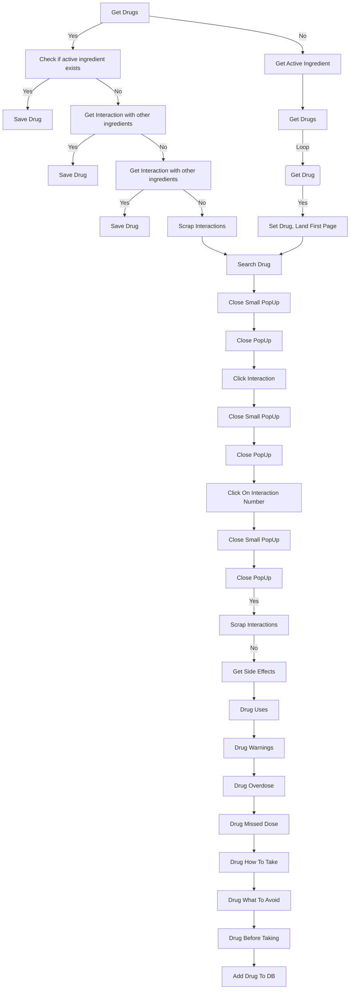

```mermaid
graph TD;


A[Get Drugs] -- Yes --> B[Check if active ingredient exists];
A -- No --> C[Get Active Ingredient];

B -- Yes --> D[Save Drug];
B -- No --> E[Get Interaction with other ingredients];
E -- Yes --> F[Save Drug];
E -- No --> G[Get Interaction with other ingredients];

G -- Yes --> H[Save Drug];
G -- No --> I[Scrap Interactions];

C --> J[Get Drugs];

J --> |Loop| K(Get Drug);
K -- Yes --> L[Set Drug, Land First Page];
L --> M[Search Drug];
M --> N[Close Small PopUp];
N --> O[Close PopUp];
O --> P[Click Interaction];
P --> Q[Close Small PopUp];
Q --> R[Close PopUp];

I --> M;

R --> S[Click On Interaction Number];
S --> T[Close Small PopUp];
T --> U[Close PopUp];
U -- Yes --> V[Scrap Interactions];
V -- No --> W[Get Side Effects];
W --> X[Drug Uses];
X --> Y[Drug Warnings];
Y --> Z[Drug Overdose];
Z --> AA[Drug Missed Dose];
AA --> AB[Drug How To Take];
AB --> AC[Drug What To Avoid];
AC --> AD[Drug Before Taking];
AD --> AE[Add Drug To DB];
```
