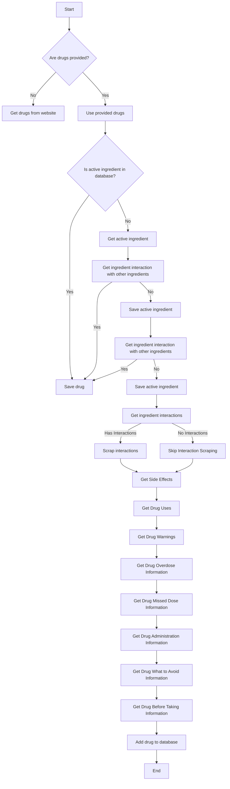

```mermaid

graph TD;
    A[Start] --> B{Are drugs provided?};
    B -- No --> C[Get drugs from website];
    B -- Yes --> D[Use provided drugs];
    D --> E{Is active ingredient in database?};
    E -- Yes --> F[Save drug];
    E -- No --> G[Get active ingredient];
    G --> H[Get ingredient interaction with other ingredients];
    H -- Yes --> F;
    H -- No --> K[Save active ingredient];
    K --> L[Get ingredient interaction with other ingredients];
    L -- Yes --> F;
    L -- No --> M[Save active ingredient];
    M --> N[Get ingredient interactions];
    N -- Has Interactions --> T[Scrap interactions];
    N -- No Interactions --> U[Skip Interaction Scraping];
    T --> V[Get Side Effects];
    V --> W[Get Drug Uses];
    W --> X[Get Drug Warnings];
    X --> Y[Get Drug Overdose Information];
    Y --> Z[Get Drug Missed Dose Information];
    Z --> AA[Get Drug Administration Information];
    AA --> AB[Get Drug What to Avoid Information];
    AB --> AC[Get Drug Before Taking Information];
    AC --> AD[Add drug to database];
    AD --> AE[End];
    U --> V;


```
