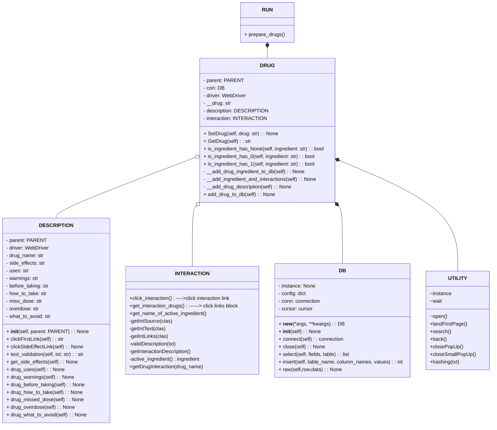
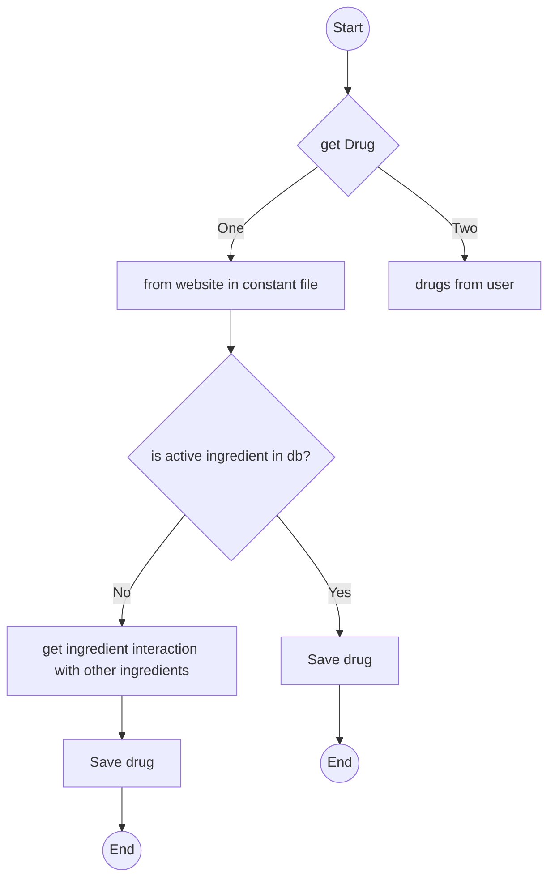

class diagrame
---
---

```mermaid

classDiagram

    DRUG o-- DESCRIPTION
    DRUG o-- INTERACTION
    DRUG *-- DB
    DRUG *-- UTILITY
    RUN *-- DRUG


    class DB {
        - instance: None
        - config: dict
        - conn: connection
        - cursor: cursor
        + __new__(*args, **kwargs): DB
        + __init__(self): None
        + connect(self): connection
        + close(self): None
        + select(self, fields, table): list
        + insert(self, table_name, column_names, values): int
        + raw(self,row,data): None
    }


    class UTILITY{
        ~instance 
        ~wait
        ~open()
        +landFirstPage()
        +search()
        +back()
        +closePopUp()
        +closeSmallPopUp()
        +hashing(txt)
    }
    
    class INTERACTION{
        +click_interaction() ---->click interaction link
        +get_interaction_drugs() ------> click links block
        +get_name_of_active_ingredient()
        -getIntSource(clas)
        -getIntText(clas)
        -getIntLinks(clas)
        -validDescription(txt)
        -getInteractionDescription()
        -active_ingredient() ingredient
        +getDrugInteraction(drug_name)
        
    }

    class DESCRIPTION{
        - parent: PARENT
        - driver: WebDriver
        - drug_name: str
        - side_effects: str
        - uses: str
        - warnings: str
        - before_taking: str
        - how_to_take: str
        - miss_dose: str
        - overdose: str
        - what_to_avoid: str
        + __init__(self, parent: PARENT): None
        + clickFirstLink(self): str
        + clickSideEffectLink(self): None
        + text_validation(self, txt: str): str
        + get_side_effects(self): None
        + drug_uses(self): None
        + drug_warnings(self): None
        + drug_before_taking(self): None
        + drug_how_to_take(self): None
        + drug_missed_dose(self): None
        + drug_overdose(self): None
        + drug_what_to_avoid(self): None
    }

    class DRUG{
        - parent: PARENT
        - con: DB
        - driver: WebDriver
        - __drug: str
        - description: DESCRIPTION
        - interaction: INTERACTION
        + SetDrug(self, drug: str): None
        + GetDrug(self): str
        + is_ingredient_has_None(self, ingredient: str): bool
        + is_ingredient_has_0(self, ingredient: str): bool
        + is_ingredient_has_1(self, ingredient: str): bool
        - __add_drug_ingredient_to_db(self): None
        - __add_ingredient_and_interactions(self): None
        - __add_drug_description(self): None
        + add_drug_to_db(self): None
    }
    

    class RUN{
        + prepare_drugs()
    }
```

---
Flow chart
---
---

```mermaid
graph TD
B((Start))
    B --> C{get Drug }
    C -->|One| D[from website in constant file]
    C -->|Two| E[drugs from user]
    D --> F{is active ingredient in db?}
    F --> |Yes| f[Save drug]
    F --> |No| G[get ingredient interaction with other ingredients ]
    G -->g[Save drug]
    g --> e((End))
    f --> z((End))
```