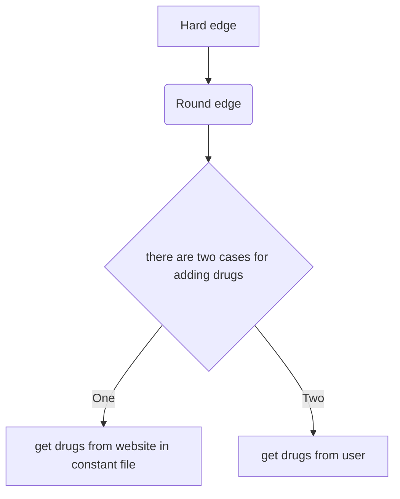

```mermaid
graph TD
A[Hard edge] -->B(Round edge)
    B --> C{there are two cases for adding drugs }
    C -->|One| D[get drugs from website in constant file]
    C -->|Two| E[get drugs from user]
```